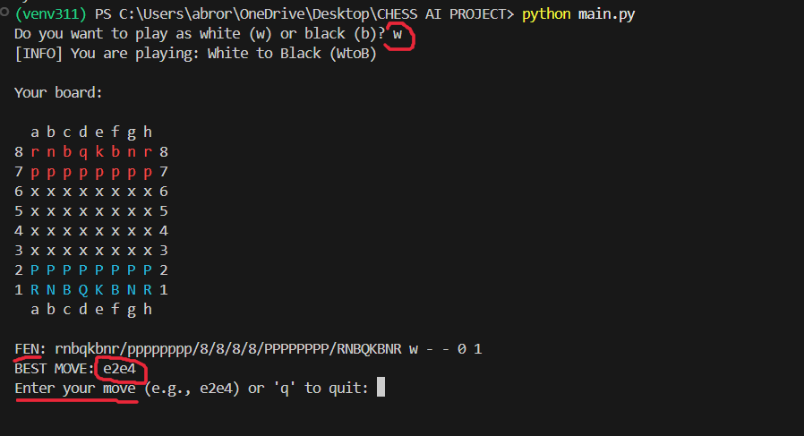

# Chess AI Move Assistant

Chess AI Move Assistant is a Python-based command-line application that analyzes live chess positions and recommends the optimal next move using the Stockfish engine. This tool is designed for players who want a lightweight, fast, and intelligent way to improve their strategic decision-making without the overhead of a graphical interface.

Developed with the goal of accelerating post-game and in-game analysis, this project serves the Chicagoland Chess community and anyone interested in combining artificial intelligence with classical board games.

---

## Overview

This application simulates a chessboard in the terminal. Users interact with the board by entering moves, which the system uses to update an internal board state. The state is then converted into Forsyth-Edwards Notation (FEN), which is passed to the Stockfish engine to determine the best move. The app uses a modular structure that separates the board logic, FEN conversion, and engine connection, making it clear, maintainable, and extensible.

---

## Features

- Interactive command-line chess interface  
- Real-time FEN generation from board state  
- Automated best-move suggestion using Stockfish 17.1  
- Cross-platform Python codebase  
- Support for both black and white perspectives  
- Color-coded terminal output for enhanced readability (platform dependent)  

---

## Sample Output

Below is a sample of what the board output looks like in the terminal after a few moves:

---

## Installation

### Prerequisites

- Python 3.11 or higher  
- pip (Python package manager)

### 1. Clone the Repository

git clone https://github.com/ChrisMoc07/chess_ai_move_assistant.git  
cd chess_ai_move_assistant

### 2. Set Up a Virtual Environment

python3.11 -m venv venv

#### Activate the Environment

Windows:  
venv\Scripts\activate

macOS/Linux:  
source venv/bin/activate

### 3. Install Dependencies

pip install python-chess stockfish pygame

### 4. Download and Set Up Stockfish

1. Download Stockfish 17.1 from: https://stockfishchess.org/download/  
2. Unzip the executable and place it in a directory called `stockfish/` at the project root  
3. Ensure the path matches:  
   stockfish/stockfish-windows-x86-64-avx2.exe  
4. If you use a different OS or path, update `stockfish_engine.py` accordingly.

---

## Usage

To run the application:

python main.py

You will be prompted to select your side (white or black). After each move, the system updates the board and displays the best move calculated by Stockfish.

---

## Project Structure

chess_ai_move_assistant/  
├── main.py                 # Main application logic and interface  
├── board_reader.py         # Converts board state into FEN notation  
├── stockfish_engine.py     # Handles Stockfish engine communication  
├── stockfish/              # Contains the Stockfish executable  
├── example_result.png      # Sample output image  
├── README.md               # Project documentation  

---

## Contributors

Name       | Role                      | Contributions  
-----------|---------------------------|------------------------------------------------------------  
Chris Moc  | Lead Developer            | Designed and implemented the codebase including board logic, FEN conversion, user interface, and gameplay flow.  
Abror      | Engine Integration Engineer | Integrated the Stockfish engine, managing subprocess communication and move evaluation.  

---

## Future Development

- Integrate computer vision to recognize real-world chessboards using OpenCV  
- Build a graphical user interface (GUI) using Pygame or Tkinter  
- Add support for Portable Game Notation (PGN) import and export  
- Enable feedback system for move evaluation and blunder analysis  
- Extend functionality to mobile platforms with camera-based board detection  

---

## License

This project is licensed under the MIT License. See the LICENSE file for full license details.

---

## Contact

Chris Moc  
Email: mocchris303@gmail.com  
LinkedIn: https://www.linkedin.com/in/your-link-here  
GitHub: https://github.com/ChrisMoc07
